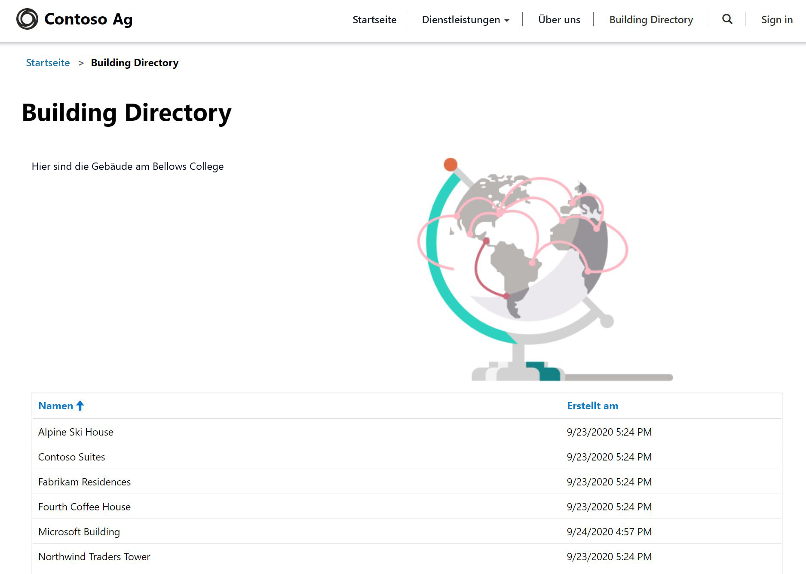

---
lab:
    title: 'Lab 5: Erstellen eines Power Apps-Portals'
    module: 'Modul 3: Erste Schritte mit Power Apps'
---

# Modul 3: Erste Schritte mit Power Apps

## Lab 4: Erstellen eines Power Apps-Portals

# Szenario

Das Bellows College ist eine Bildungsorganisation mit mehreren Gebäuden auf dem Campus. Campusbesuche werden derzeit in Papierzeitschriften aufgezeichnet. Die Informationen werden nicht konsistent erfasst und es gibt keine Möglichkeit, Daten über die Besuche auf dem gesamten Campus zu sammeln und zu analysieren.

Die Campusverwaltung möchte den Besuchern Informationen über die Gebäude auf dem Campus zur Verfügung stellen. Besucher können die Gebäudeliste auf einer Website anzeigen, die mithilfe eines Power Apps-Portals erstellt wird.

In diesem Lab stellen Sie ein Power Apps-Portal bereit und erstellen eine Portalwebseite, auf der eine Liste der Gebäude auf dem Campus angezeigt wird.

# Weiterführende Schritte des Lab

Sie halten sich beim Design des Power Apps-Portals an die nachstehende Gliederung:

* Ein Power Apps-Portal in der Common Data Service-Umgebung bereitstellen
* Eine Webseite erstellen und konfigurieren, die eine Liste der Gebäude anzeigt
* Ein neues Design erstellen und auf das Portal anwenden

## Voraussetzungen

* Beendigung von **Modul 0 Lab 0 – Lab-Umgebung überprüfen**
* Beendigung von **Modul 2 Lab 1 – Einführung in Common Data Service**

## Vor dem Beginn zu beachtende Dinge

* Power Apps-Portale-Apps werden immer anhand einer Vorlage anstelle einer leeren Anwendung gestartet. Wenn Sie ein Portal bereitstellen, enthält es bereits Seiten, Menüs und ein Standarddesign.

# Übung Nr. 1: Ein Power Apps-Portal bereitstellen

**Ziel:** In dieser Übung stellen Sie ein Power Apps-Portal in Ihrer Umgebung bereit, auf das überall im World Wide Web zugegriffen werden kann.

## Aufgabe Nr. 1: Power Apps-Portal bereitstellen

1.  Erstellen Sie eine neue Portal-App.

    -   Anmelden bei <https://make.powerapps.com>

    -   Wenn die oben rechts angezeigte **Umgebung** nicht Ihre Übungsumgebung ist, wählen Sie Ihre Umgebung aus.

    -   Klicken Sie unter **Ihre eigene App erstellen** auf das Panel **Portal aus leerer Vorlage**

2.  Geben Sie neue Portaldetails an

    -   Geben Sie **Bellows College-Besucher** als **Name** des Portals ein

    -   Geben Sie eine eindeutige URL an; **etwas**.powerappsportals.com (wenn der Name bereits verwendet wird, wählen Sie einen anderen)

    -   Wählen Sie eine **Sprache** für das Basisportal aus

    -   Klicken Sie auf **Erstellen**.

3. Der Portal-Bereitstellungsprozess dauert zwischen 30 und 45 Minuten.  Bitte haben Sie Geduld.

Aufgabe Nr. 2: Navigieren Sie zum Portal
--------------------------------

1.  Sie erhalten eine Benachrichtigung in<https://make.powerapps.com>, wenn das Portal bereitgestellt wurde

2.  Öffnen Sie das neue Portal

    -   Klicken Sie auf **Apps**

    -   Suchen Sie die App mit dem **Typ** **Portal**

    -   Klicken Sie auf den Namen der App

3.  Sie sollten auf eine Portal-Website mit der Angebotsseite und mit einer Begrüßungsnachricht weitergeleitet werden

Übung Nr. 2: Eine Portal-Webseite erstellen
===============================

**Ziel:** In dieser Übung erstellen Sie eine neue Webseite, auf der statische Inhalte sowie eine Liste der Gebäude aus Common Data Service angezeigt werden.

Aufgabe Nr. 1: Eine Webseite erstellen
--------------------------------

1.  Öffnen Sie Power Apps-Portale Studio

    -   Melden Sie sich bei <https://make.powerapps.com> an (möglicherweise ist dies noch auf Ihren Registerkarten geöffnet)

    -   Suchen Sie die App mit dem **Typ** **Portal**

    -   Klicken Sie auf die Schaltfläche mit den drei Punkten (**...**), und wählen Sie **Bearbeiten** aus

2.  Sie befinden sich jetzt in Power Apps-Portale Studio. Hier können Sie Portalinhalte ändern und erstellen.

3.  Erstellen Sie eine neue Seite

    -   Wählen Sie auf der Befehlsleiste **Neue Seite** aus

    -   Zeigen Sie auf **Feste Layouts**, und wählen Sie **Seite mit Titel** aus

4.  Ändern Sie die Seiteneigenschaften

    -   Im Eigenschaftenbereich unter **Anzeige** ändern Sie den **Namen** von **Neue Seite (1)** in **Gebäudeverzeichnis** und drücken die Tabulatortaste (um das automatische Speichern zu starten)

    -   Der Titel der Seite sollte jetzt **Gebäudeverzeichnis** lauten

    -   In der **Teil-URL** ändern Sie den Wert in **Gebäudeverzeichnis** und drücken die Tabulatortaste (um das automatische Speichern zu starten)

Aufgabe Nr. 2: Statischen Inhalt hinzufügen
--------------------------------

1.  Fügen Sie der Webseite einen neuen Abschnitt hinzu

    -   Wählen Sie auf der Canvas (Bereich, der die Webseite zeigt) den Abschnitt **Seitenkopie** aus. Dies ist das große Feld um die 2 Textsätze in der Mitte Ihrer Seite.

    -   Wählen Sie auf dem Toolbelt (linke Seite) das Symbol **Komponenten** aus

    -   Wählen Sie aus dem Bereich **Abschnittslayout** die Option **Abschnitt mit zwei Spalten** aus

2.  Statischen Text hinzufügen

    -   Wählen Sie auf der Canvas (Bereich, der die Webseite zeigt) die linke Spalte aus

    -   Wählen Sie auf dem Toolbelt (linke Seite) das Symbol **Komponenten** aus

    -   Wählen Sie aus dem Bereich **Portalkomponenten** die Option **Text** aus

    -   Geben Sie im neuen Textbereich folgenden Text ein:
          ```
          Nachfolgend ist das Gebäudeverzeichnis dargestellt.
          ```
    -   Wählen Sie das Textfeld über dem gerade bearbeiteten Textfeld aus, und klicken Sie in der Befehlsleiste auf **Löschen**, um den Standardtext zu entfernen.

3. Ein Bild hinzufügen

    -   Wählen Sie auf der Canvas (Bereich, der die Webseite zeigt) die rechte Spalte aus

    -   Wählen Sie auf dem Toolbelt (linke Seite) das Symbol **Komponenten** aus

    -   Wählen Sie aus dem Bereich **Portalkomponenten** die Option **Bild** aus

    -   Klicken Sie im Eigenschaftenbereich auf **Ein Bild auswählen**. Suchen Sie und wählen Sie **Produkt A.png**
    
    -   Klicken Sie im Eigenschaftenbereich auf die Dropdownliste des Formatierungsabschnitts, und ändern Sie die **Breite** in 70 % (geben Sie unbedingt % ein). Sie können verschiedene Bildgrößen ausprobieren, bis alles wunschgemäß aussieht.

4.  Klicken Sie auf **Website durchsuchen** um die Seite, wie sie jetzt ist, anzuzeigen.  Beachten Sie, dass die Option **Gebäudeverzeichnis** im Hauptmenü verfügbar ist.

Aufgabe Nr. 3: Eine Listenkomponente hinzufügen
--------------------------------

1.  Öffnen Sie Power Apps-Portale Studio

    -   Melden Sie sich bei <https://make.powerapps.com> an (möglicherweise ist dies noch auf Ihren Registerkarten geöffnet)

    -   Suchen Sie die App mit dem **Typ** **Portal**

    -   Klicken Sie auf die Schaltfläche mit den drei Punkten (**...**), und wählen Sie **Bearbeiten** aus
    
2.  Bearbeiten Sie die vorhandene Seite, die Sie zuvor erstellt haben

    -   Wählen Sie auf dem Toolbelt (linke Seite) die Option **Seiten** 

    -   Suchen und wählen Sie die Seite **Gebäudeverzeichnis**, die Sie zuvor erstellt haben
    
3.  Fügen Sie eine Listenkomponente hinzu

    -   Wählen Sie auf dem Toolbelt (linke Seite) das Symbol **Komponenten** aus

    -   Wählen Sie aus dem Bereich **Abschnittslayout** die Option **Einspaltiger Abschnitt** aus (ein Abschnitt wird unter dem Bild und dem Text auf der Webseite angezeigt)

    -   Wählen Sie den neuen Spaltenabschnitt auf der Canvas aus

    -   Wählen Sie auf dem Toolbelt (linke Seite) das Symbol **Komponenten** aus

    -   Wählen Sie aus dem Bereich **Portalkomponenten** die Option **Liste** aus (eine Listenkomponente wird im neuen Abschnitt angezeigt)
    
4.  Konfigurieren Sie die Listenkomponente

    -   Wählen Sie die Listenkomponente auf der Canvas aus

    -   Geben Sie im Eigenschaftenbereich (rechte Seite) im Feld **Name** die Zeichenfolge **Gebäudeliste** ein

    -   Wählen Sie aus der Dropdownliste im Feld **Entität** die Option **Gebäude** aus

    -   In **Ansichten** wählen Sie **Aktive Gebäude** aus

    -   Behalten Sie die verbleibenden Standardeinstellungen bei
    
5.  Klicken Sie auf **Website durchsuchen**, um die Seite anzuzeigen. Die Liste der Gebäude aus dem Common Data Service sollte auf der Webseite angezeigt werden.

Übung Nr. 3: Das Portaldesign ändern
===============================

**Ziel:** In dieser Übung erstellen Sie ein neues Design, das das Farbschema Ihres Portals ändert. 

Aufgabe Nr. 1: Design anwenden und bearbeiten
--------------------------------

1.  Öffnen Sie Power Apps-Portale Studio

    -   Melden Sie sich bei <https://make.powerapps.com> an (möglicherweise ist dies noch auf Ihren Registerkarten geöffnet)

    -   Suchen Sie die App mit dem **Typ** **Portal**

    -   Klicken Sie auf die Schaltfläche mit den drei Punkten (**...**), und wählen Sie **Bearbeiten** aus
    
2.  Wenden Sie ein Basisdesign an, und passen Sie es an

    -   Wählen Sie auf dem Toolbelt (linke Seite) das Symbol **Komponenten** aus
    
    -   Klicken Sie auf den Schalter für **Basisdesign aktivieren**, um diese Funktion einzuschalten.
    
    -   Klicken Sie in einer der Voreinstellungen auf die Schaltfläche mit den drei Punkten (**...**), und wählen Sie **Anpassen** aus
    
    -   Eine Kopie des Basisdesigns wurde erstellt. 
    
    -   Probieren Sie im Eigenschaftenbereich unterschiedliche Farben aus, und untersuchen Sie die Auswirkungen dieser Änderungen auf Ihr Portal.
    
    -   Benennen Sie Ihr Design um
    
3.  Änderungen speichern

    -   Klicken Sie auf der Befehlsleiste auf **Synchronisierungskonfiguration**


Ihr App-Layout sollte etwa die folgende Struktur aufweisen:



# Herausforderungen

* Erstellen Sie eine andere Ansicht von „Gebäude“, in der nur der Gebäudename angezeigt wird. Sie müssen in Portal Studio **Website durchsuchen** auswählen, um die Änderungen anzuzeigen.
* Klicken Sie im Toolbelt auf das Symbol **Designs**, und bearbeiten Sie das CSS Ihres benutzerdefinierten Designs.
* Erstellen Sie eine Seite mit der Komponente **Formular**, und ändern Sie eine Komponente **Liste**, um mit dem Formular Common Data Service-Datensätze hinzuzufügen oder zu bearbeiten.
* Aktivieren Sie **Entitätsberechtigungen** für die **Einstellungen** einer Komponente **Liste**. Was geschieht mit den Daten?
* Wählen Sie in Portal Studio das Quellcode-Editor-Symbol `</>` aus, um die Seitenquelle anzuzeigen. Wenn Sie mit HTML vertraut sind, nehmen Sie einige Änderungen vor, und zeigen die Ergebnisse an.
